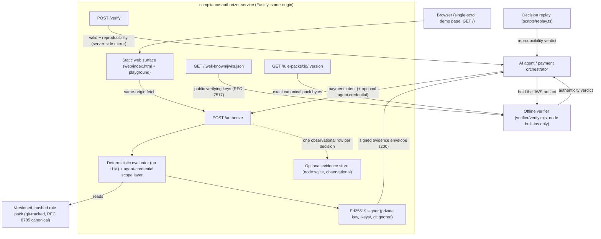
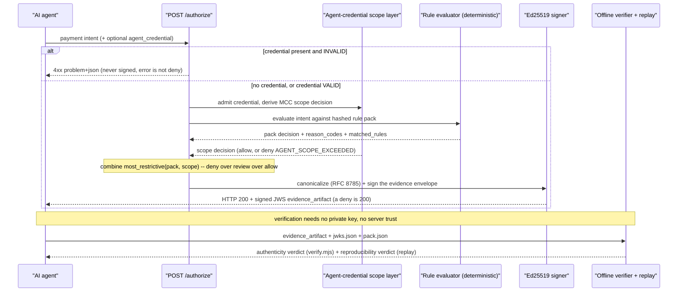

# compliance-authorizer

Runtime compliance authorization for agentic payments. A small, MIT-licensed service that
takes an AI agent's **payment intent** and returns a cited, tamper-evident
**allow / deny / review** decision with a cryptographic evidence envelope — driven by
versioned, hashed rule packs. The first rule pack is an **uncertified synthetic Shariah
profile (v0.1)**.

> **UNCERTIFIED — synthetic demo rule pack.** Not a fatwa. Not certified. Not production
> advice. Decisions here are illustrative; a certified version would carry standard
> citations and a scholar signature over the rule pack's hash. What you reproduce from
> this service is **committee-reviewable demo evidence**.

## What it is (and isn't)

- A runtime authorization API (`POST /authorize` → a signed decision envelope),
  verification endpoints (`GET /.well-known/jwks.json`, `GET /rule-packs/:id/:version`,
  `POST /verify`), a standalone **offline verifier** and decision **replay** tool, and a
  single-scroll **web playground + inline evidence viewer** served same-origin.
- Decision **provenance** — a signed allow/deny/review record. **Not** PII redaction.
- **Deterministic** — no LLM in the decision path; the same intent + rule-pack hash always
  yields the same decision.
- The **UNCERTIFIED marker lives on both surfaces, under different names**: the HTTP
  response mirrors it as top-level `rule_pack_status` (readable without decoding
  anything); inside the signed envelope — the durable artifact — it is carried at
  `scholar_signature_ref.status`. The envelope is the canonical record; the response
  field is a convenience mirror.

## Status

**W1 — crypto/API core: complete (v0.1.0.0).** `POST /authorize` issues Ed25519-signed
evidence envelopes (JWS-compact over RFC 8785 canonical JSON); the standalone offline
verifier (`verifier/verify.mjs`, node built-ins only) checks them with zero server trust;
the uncertified synthetic Shariah v0.1 pack and the crypto test matrix (negative-alg,
property-based, canonicalization invariance) are in.

**W2 — backend: complete (v0.2.1.0).** `GET /.well-known/jwks.json` publishes all
historical verifying keys (RFC 7517) so any envelope stays offline-verifiable across key
rotation. `GET /rule-packs/:id/:version` serves the exact canonical pack bytes a decision
was made against (sha256 of the response body equals the envelope's `rule_pack_hash`).
`POST /verify` accepts an evidence artifact; a **well-formed** request always returns HTTP 200
with two distinct verdict fields: `valid` (authenticity — was this signed by the issuer's key,
intact and canonical?) and `reproducibility` (does the cited decision re-derive against the cited
pack?). `valid:false` is a verdict, not a 4xx. A malformed request (missing field, wrong type,
extra field) returns 400 problem+json — error ≠ deny on the verification path too. Decision replay
(`scripts/replay.ts`) re-derives the decision from the cited intent and pack; `--jwks` adds an
authenticity gate so a single exit code covers both properties. The verifier enforces the EXACT
v0.1 envelope schema and rejects RFC 8785 lone surrogates on both canonicalizers.

**W3-4 — web surfaces + backend remainder: complete.** A single-scroll demo page
(`GET /`, served same-origin) carries the decision-first landing, the playground, and the
**inline evidence viewer** that renders each signed decision in place as a committee-reviewable
demo certificate (UNCERTIFIED, amber/ochre, never red). The decision path now admits an
**optional agent credential** with two-layer most-restrictive scope enforcement (see
[Agent-credential enforcement](#agent-credential-enforcement)); decisions are persisted to an
optional observational [evidence store](#configuration); and the agent-facing docs
(`docs/machine-contract.md`, `docs/reason-codes.md`, `docs/agt-mapping.md`, `llms.txt`,
`AGENTS.md`) are in. The shipped pack is **`shariah@0.1.1`**
(`rule_pack_hash 5573ec7e039e8f882a5a8d253f901dbb29951442bace5a42353be5da50522ab4`), evaluator
**0.2.0**. The locked design layer is in [`DESIGN.md`](./DESIGN.md).

`npm test` covers the full suite (typecheck + lint + tests all green). See
[`REPRODUCIBILITY.md`](./REPRODUCIBILITY.md) for the zero-trust walkthrough and
[`examples/`](./examples/) for a committed, byte-reproducible worked example.

## Quickstart

```sh
npm ci
npm run verify:fixture   # authenticity   → RESULT: PASS, decision "deny" (["MAYSIR"]), exit 0
npm run replay           # reproducibility → RESULT: REPRODUCED, exit 0
```

Both commands run **offline against committed files** — no server, no network, no key
material. `verify:fixture` is the W1 gate: the sign → offline-verify round-trip.

### Run the service and open the demo page

```sh
npm run dev              # listens on http://127.0.0.1:8787
```

Then open <http://127.0.0.1:8787/> in a browser. The single-scroll page renders the
landing, the **playground** (three synthetic scenarios — casino-hotel, mixed-revenue ETF,
subscription — each calling the real `POST /authorize` same-origin), and the **inline
evidence viewer** that shows the resulting decision as a signed, committee-reviewable demo
certificate with its cited rule, rule-pack hash, and verify affordance. The page stays
**UNCERTIFIED** throughout (amber/ochre hatch band, never red); a system error renders a
distinct dashed problem panel, never a decision certificate. There is **no OpenAPI route** —
the machine contract is documented prose (see below), not a generated spec.

Drive the API directly with `curl` (a `deny` is HTTP 200 — read the body, never the status):

```sh
curl -s http://127.0.0.1:8787/authorize \
  -H "content-type: application/json" \
  -d '{
    "profile": "shariah-v0.1",
    "merchant": { "name": "casino-hotel", "mcc": "7011", "attributes": ["casino", "gambling"] },
    "amount":   { "value": 420, "currency": "EUR" }
  }'
# → HTTP 200  { "decision": "deny", "reason_codes": ["MAYSIR"], "rule_pack_status": "uncertified", … }
```

## How it works

Two GitHub-native Mermaid diagrams (developer-facing, DESIGN.md §9). The reader-facing
scholar-attestation flow — how a future certification slots into the evidence chain — is a
styled SVG at [`web/diagrams/attestation.svg`](./web/diagrams/attestation.svg) (served at
`/diagrams/attestation.svg`), drawn in the design system rather than Mermaid.

### System diagram — components and trust surfaces



### Data-flow diagram — one decision, then independent verification



## Agent-credential enforcement

A payment intent MAY carry an **optional** `agent_credential` — a synthetic signed `did:key`
credential (`credential_type` `synthetic-agent-mcc-scope/0.1`) that encodes an allowed-MCC
scope (`{ "allowed_mcc": ["dddd", …] }`). When present and **valid**, the engine adds a
second decision layer and combines it with the rule pack **most-restrictively** (`deny` over
`review` over `allow`):

- If the intent's `merchant.mcc` is in the credential's `allowed_mcc`, the scope layer
  allows and the pack decision stands.
- If the MCC is out of scope, the scope layer denies with the one engine-level reason code
  **`AGENT_SCOPE_EXCEEDED`**. A valid credential whose scope excludes the MCC is a
  **decision, not an error** — a **signed `deny` at HTTP 200**, with the full evidence
  envelope, exactly like any other decision. Because the credential travels *inside*
  `payment_intent`, it is covered by `intent_hash` and re-verified on replay.

The always-200 caveat holds without exception: **every** decision (`allow` / `deny` /
`review`, including `AGENT_SCOPE_EXCEEDED`) is HTTP 200 + a signed envelope — read
`body.decision`, never the status code. An **invalid** credential (malformed, tampered,
alg-confused, wrong issuer, bad payload schema) is the opposite category: a `422`
`application/problem+json` integration failure (`…/problems/invalid-agent-credential`),
**never** a signed deny. That boundary is the `error ≠ deny` invariant applied to
credentials. Full semantics: [`docs/evaluator-semantics.md`](./docs/evaluator-semantics.md)
§7; the closed reason-code set: [`docs/reason-codes.md`](./docs/reason-codes.md).

## Documentation

| Document | What it covers |
|---|---|
| [`docs/getting-started.md`](./docs/getting-started.md) | Tutorial: clone to first signed decision in five minutes |
| [`docs/machine-contract.md`](./docs/machine-contract.md) | The normative always-200 / 4xx machine contract, with real captured request/response pairs |
| [`docs/reason-codes.md`](./docs/reason-codes.md) | The closed reason-code vocabulary + the actionable problem-type (`problem+json`) reference |
| [`docs/evaluator-semantics.md`](./docs/evaluator-semantics.md) | Pinned evaluator contract (operators, field resolution, D12, the agent-credential scope layer) |
| [`docs/agt-mapping.md`](./docs/agt-mapping.md) | The decision/evidence model projected onto a `governance.toolkit/v1` policy shape (schema-mapped, not engine-verified) |
| [`docs/demo-storyboard.md`](./docs/demo-storyboard.md) | The 3-minute, six-beat reader-targeted demo-video storyboard |
| [`REPRODUCIBILITY.md`](./REPRODUCIBILITY.md) | Zero-trust walkthrough: verify and replay any decision offline |
| [`examples/README.md`](./examples/README.md) | Committed byte-reproducible worked example (one signed `deny`) |
| [`llms.txt`](./llms.txt) + [`AGENTS.md`](./AGENTS.md) | Agent-facing index + condensed runtime consumption contract (reading a deny, halting, escalating) |
| [`CONTRIBUTING.md`](./CONTRIBUTING.md) | Development setup, testing, conventions |
| [`DESIGN.md`](./DESIGN.md) | Locked design layer for the web surfaces |

## Configuration

| Variable | Default | Description |
|---|---|---|
| `PORT` | `8787` | HTTP port the service listens on. Must be an integer in `[1, 65535]`. |
| `KEYS_DIR` | `.keys/` | Directory where the Ed25519 signing key is stored (gitignored). Created and populated automatically on first boot. |
| `EVIDENCE_DB` | `data/evidence.sqlite` | Path to the optional file-backed evidence store. The `data/` directory is gitignored. |

**Evidence store (observational).** On **Node ≥ 22.6** the built-in `node:sqlite` backs the
evidence store with **no dependency and no extra node flag** — `npm run dev`, `npm start`,
and `npm test` work as-is (the `dev` script's existing `--no-warnings` suppresses the SQLite
`ExperimentalWarning` at runtime). The store writes one observational row per issued decision
(`decision_id`, decision, reason codes, rule-pack id/version/hash, evaluator version,
`intent_hash`, envelope version, timestamp, and the full JWS evidence artifact — **synthetic
data only**). It is purely observational: it never changes the response shape, the envelope
bytes, or determinism. A store write failure returns `500 problem+json` with **no envelope**
(`error ≠ deny` at the storage boundary). `better-sqlite3` is a documented fallback seam
(not installed); if `node:sqlite` is ever unavailable, boot fails closed with one error
naming both `node:sqlite` and `npm install better-sqlite3`, or the store can be left disabled
(the server runs stateless and serves decisions unchanged).

## License

MIT © 2026 Nouaïm Souiki
</content>
</invoke>
